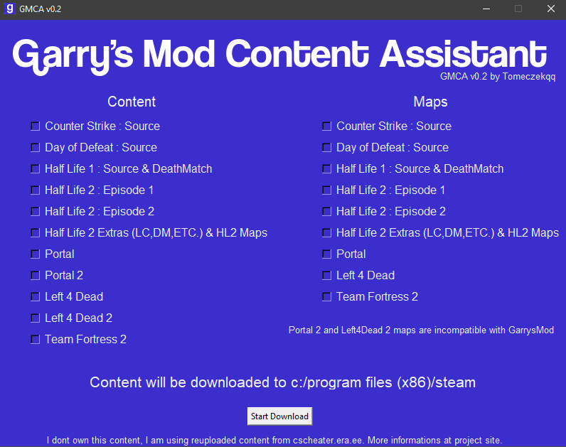

# Garry's Mod Content Assistant v0.3 
Easy Garry's Mod Content installation tool. You can install gmod content in just 2 clicks. 

## Download
- coming soon

## Requirements
- Python 3
- pySmartDL
- bs4
- requests
- tkinter

## Changelog [v0.3]
- Rewrited using classes
- Fixed steam directory detection
- Support JSON instead of INI
- Fixed closing bug
- Added support for unicoded file name 
- Updated UI

## TODO
- Mannualy select steam path
- Export error to file
- Website
- RAR file support

